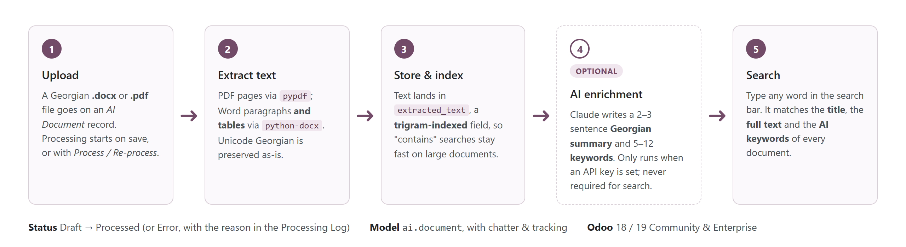
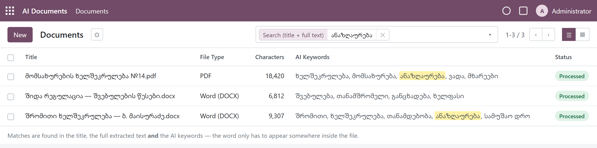
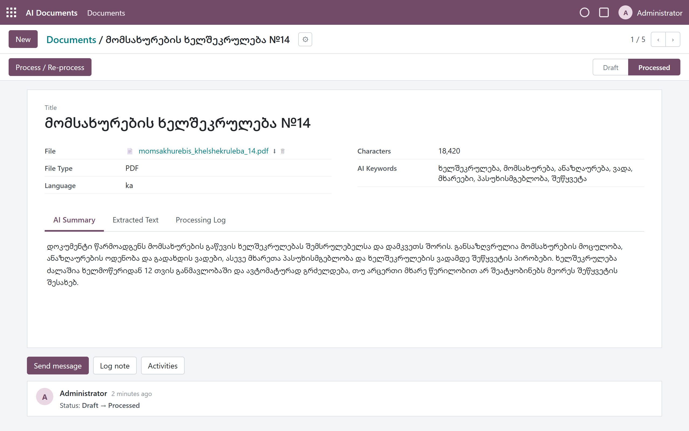

# AI Document Search for Odoo (Georgian)

An Odoo 18/19 module that makes the **contents** of uploaded Georgian Word and PDF
files searchable. Upload a `.docx` or `.pdf`, the text is extracted and stored on the
record, and from then on **typing any word in the search bar finds every document that
contains it** — not just documents with that word in the title. Optionally, Claude adds
a short Georgian summary and a keyword list to each document.

*ქართული ვერსია: [README_ka.md](README_ka.md)*



| | |
|---|---|
|  |  |
| The list view: a search for **ანაზღაურება** finds every document whose text or keywords contain the word | The document form: file, status, AI keywords, and the *AI Summary* / *Extracted Text* / *Processing Log* tabs |

> The images are illustrations rendered from the module's views with sample data,
> not screenshots of a customer database.

## What it does

- **Upload** a Georgian `.docx` or `.pdf` on an *AI Document* record (menu **AI Documents › Documents**).
- **Extracts the text automatically** on save: PDF pages with `pypdf`, Word paragraphs
  *and tables* with `python-docx`. Georgian Unicode text is stored as-is.
- **Full-text search from the search bar.** The default search field matches the title,
  the extracted text and the AI keywords at once; there are also *Text only* and
  *Keywords* fields, status filters and *Group by* status / file type.
- **Fast on large documents.** The text field has a PostgreSQL trigram index, so
  "contains" searches do not slow down as documents grow.
- **Optional AI enrichment.** With an Anthropic API key configured, each processed
  document also gets a 2–3 sentence **Georgian summary** and **5–12 keywords**.
  Search never depends on it.
- **Status and log.** Every document is *Draft → Processed* (or *Error*); the
  *Processing Log* tab explains what happened (detected type, characters extracted,
  a warning for scanned PDFs, AI step result). Changes are tracked in the chatter.
- **Access rights.** Internal users can create, read and edit documents;
  only administrators (Settings group) can delete them.

## Requirements

| | |
|---|---|
| Odoo | 18.0 or 19.0 (Community or Enterprise), self-hosted or Odoo.sh |
| Python | `pypdf`, `python-docx` (`requests` ships with Odoo) |
| Optional AI | An [Anthropic API key](https://console.anthropic.com/) and outbound internet access from the Odoo server |

Odoo Online (SaaS) cannot run custom modules; this module needs Odoo.sh or your own server.

## Install

The folder must be named `ai_document_search` inside one of your addons directories:

```bash
cd /path/to/your/custom_addons
git clone https://github.com/SabaSoni/AI-Document-Matcher.git ai_document_search
pip install -r ai_document_search/requirements.txt
```

On Odoo.sh add `pypdf` and `python-docx` to the `requirements.txt` at the root of your
repository instead. On the Windows installer use Odoo's own Python, e.g.
`"C:\Program Files\Odoo 19.0.<build>\python\python.exe" -m pip install pypdf python-docx`.

Then restart Odoo and, in *Apps*, click **Update Apps List**, search for
**AI Document Search** and install it. Or from a terminal:

```bash
odoo-bin -c odoo.conf -d <database> -i ai_document_search --stop-after-init
```

## Use

1. Open **AI Documents › Documents** and click **New**.
2. Give it a title (if you leave it empty the filename is used), pick the `.docx` or
   `.pdf` file and save. The text is extracted immediately and the status becomes
   **Processed**.
3. Back in the list, type a word in the search bar and press Enter. The default
   *Search (title + full text)* option finds every document containing that word.

Uploading a new file onto an existing record re-extracts it; the **Process /
Re-process** button does the same by hand and shows any error directly instead of
just logging it.

## Optional: AI summary and keywords

AI is **off by default**. To turn it on, go to *Settings › Technical › System
Parameters* (developer mode) and set:

| Key | Value |
|---|---|
| `ai_document.anthropic_api_key` | your Anthropic API key |
| `ai_document.anthropic_model` | model name, default `claude-haiku-4-5-20251001` (created on install) |

From then on every processed document gets a summary (visible on the *AI Summary*
tab) and keywords (shown on the form and in the list, and included in the search).
Notes:

- The first 12,000 characters of the extracted text are sent to the Anthropic API.
- The AI step is non-fatal: if it fails (no internet, invalid key, quota), the document
  is still *Processed* and searchable, and the reason is written to the *Processing Log*.
- Documents processed before the key was set can be enriched with **Process / Re-process**.

## How the search works

- `extracted_text` and `keywords` are `Text`/`Char` fields with `index="trigram"`
  (PostgreSQL `pg_trgm`), which makes `ilike` searches fast.
- The search view's default field uses a `filter_domain` over `name`,
  `extracted_text` and `keywords`, so one search box covers all three.
- `_name_search` is overridden the same way, so a document is also found by its
  contents wherever it is looked up by name (for example in a Many2one field).

## Limits

- **Scanned PDFs** (images of pages) contain no text layer, so nothing can be
  extracted; the *Processing Log* warns about it. OCR (`tesseract` with the Georgian
  `kat` language pack, `pytesseract`, `pdf2image`) would be a separate addition.
- Legacy binary **`.doc`** files are not supported — re-save them as `.docx`.
- Odoo 17 needs two small changes: `<list>` → `<tree>` in the views and the
  `_name_search` signature of that version.

## Project layout

```
ai_document_search/
├── __manifest__.py
├── models/ai_document.py          # ai.document: extraction, AI step, search override
├── views/ai_document_views.xml    # form, list, search views, action and menus
├── security/ir.model.access.csv   # users: create/read/write, admins: delete
├── data/config_parameters.xml     # default AI model parameter (noupdate)
├── static/description/icon.png
├── docs/images/                   # images used in this README
├── requirements.txt               # pypdf, python-docx
└── README_ka.md                   # Georgian README
```

## License

LGPL-3. Author: FMG Soft.
